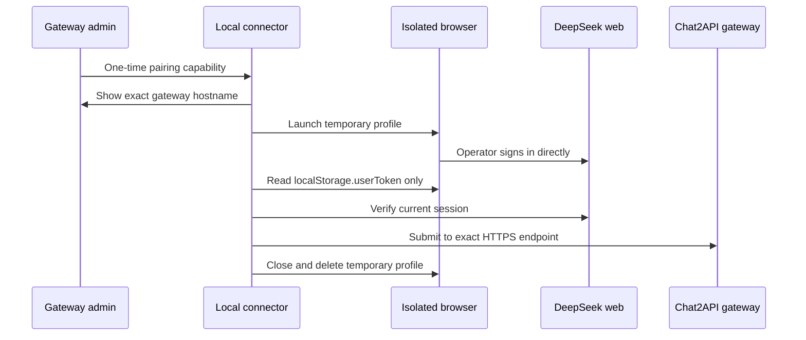

# Chat2API Session Connector

[](https://github.com/ibrahimhalilkilicarslan/chat2api-session-connector/actions/workflows/ci.yml)
[](https://github.com/ibrahimhalilkilicarslan/chat2api-session-connector/releases/tag/v0.2.0)
[](LICENSE)
[](go.mod)

A small cross-platform helper that links an operator-authorized DeepSeek web
session to a trusted
[Chat2API Web Gateway](https://github.com/ibrahimhalilkilicarslan/chat2api-web-gateway)
without a browser extension, bundled browser, background service, or access to
the user's regular browser profile.

> [!IMPORTANT]
> This is an independent community project. DeepSeek does not document this
> web-session flow as a public API. Provider changes, account controls, or terms
> may interrupt it. Use a dedicated account you are authorized to operate.

## Download

Version `v0.2.0` is a prerelease and its binaries are not code-signed. Verify the
published checksum before running it.

| Platform | Architecture | Package |
| --- | --- | --- |
| Windows | x64 | [Download ZIP](https://github.com/ibrahimhalilkilicarslan/chat2api-session-connector/releases/download/v0.2.0/chat2api-session-connector_0.2.0_windows_amd64.zip) |
| Windows | ARM64 | [Download ZIP](https://github.com/ibrahimhalilkilicarslan/chat2api-session-connector/releases/download/v0.2.0/chat2api-session-connector_0.2.0_windows_arm64.zip) |
| macOS | Intel | [Download ZIP](https://github.com/ibrahimhalilkilicarslan/chat2api-session-connector/releases/download/v0.2.0/chat2api-session-connector_0.2.0_macos_amd64.zip) |
| macOS | Apple Silicon | [Download ZIP](https://github.com/ibrahimhalilkilicarslan/chat2api-session-connector/releases/download/v0.2.0/chat2api-session-connector_0.2.0_macos_arm64.zip) |
| Linux | x64 | [Download tar.gz](https://github.com/ibrahimhalilkilicarslan/chat2api-session-connector/releases/download/v0.2.0/chat2api-session-connector_0.2.0_linux_amd64.tar.gz) |
| Linux | ARM64 | [Download tar.gz](https://github.com/ibrahimhalilkilicarslan/chat2api-session-connector/releases/download/v0.2.0/chat2api-session-connector_0.2.0_linux_arm64.tar.gz) |

[SHA256SUMS](https://github.com/ibrahimhalilkilicarslan/chat2api-session-connector/releases/download/v0.2.0/SHA256SUMS)

## How it works



The connector:

- opens a loopback-only confirmation page,
- validates a ten-minute one-time pairing capability,
- launches installed Chrome, Edge, Chromium, or Brave with a temporary profile,
- waits for the operator to sign in directly on DeepSeek,
- reads only DeepSeek's `localStorage.userToken`,
- verifies the session against DeepSeek's current-user endpoint,
- submits it to the exact confirmed gateway endpoint without following redirects,
- removes the temporary browser profile when the operation ends.

It does not bundle a browser, read a default browser profile, capture passwords
or OTP values, persist tokens, collect telemetry, install a browser extension,
or remain running in the background.

## Use with Chat2API

1. Install the connector for the current operating-system user.
2. Open the Chat2API gateway admin console.
3. Select **Add account**.
4. Choose the connector-based flow.
5. Confirm the exact gateway hostname on the local page.
6. Complete DeepSeek sign-in in the isolated browser window.
7. Return to Chat2API and run the account health check.

Windows and Linux register a per-user `chat2api-connector://` protocol handler,
allowing the admin console to launch the connector with the one-time capability
already loaded. Direct launch shows a completion guide instead of requesting a
code immediately. Manual code entry remains a recovery path and the current
macOS onboarding method.

## Browser behavior

The connector prefers the supported Chromium-based browser configured as the
system default. If it is unavailable, it discovers an installed Chrome, Edge,
Brave, or Chromium executable.

Every operation uses a new `--user-data-dir`. It never attaches to a running
browser or the user's regular profile. Human-verification and sign-in redirects
are retried with bounded backoff so the browser does not close before a valid
session is available.

## Security boundaries

- Local HTTP binds only to `127.0.0.1` on an operating-system-selected port.
- Local pages use an unguessable capability path and strict Host validation.
- Only the exact `https://chat.deepseek.com` origin is eligible for extraction.
- Only `localStorage.userToken` is read.
- Provider tokens and pairing capabilities remain memory-only.
- Gateway targets must use HTTPS, except explicit localhost development.
- URL credentials, query strings, fragments, and HTTP redirects are rejected.
- The exact gateway hostname is shown before transfer.
- The protocol handler is per-user and requires no administrator privileges.

Read the complete [security model](docs/security.md) and
[pairing protocol](docs/protocol.md). Report vulnerabilities privately through
[GitHub Security Advisories](https://github.com/ibrahimhalilkilicarslan/chat2api-session-connector/security/advisories/new).

## Development

Requirements: Go `1.26` or newer.

```bash
make check
```

Run locally:

```bash
go run ./cmd/chat2api-connector
```

Build all supported archives:

```bash
make release VERSION=0.2.0
```

The release build targets Windows, macOS, and Linux on amd64 and arm64.
`make check` runs formatting, vet, tests, race tests, vulnerability analysis,
and a local build.

See the [release process](docs/release.md) before distributing binaries.
Authenticode signing and Apple Developer ID signing/notarization remain required
for a stable, broad-distribution release.

## License

Chat2API Session Connector is distributed under the [MIT License](LICENSE).
